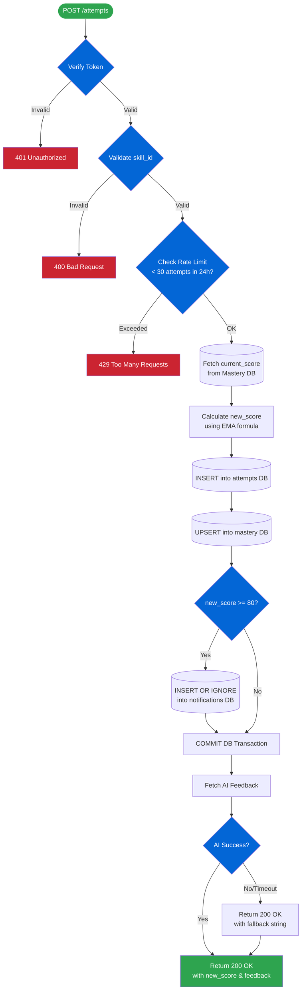
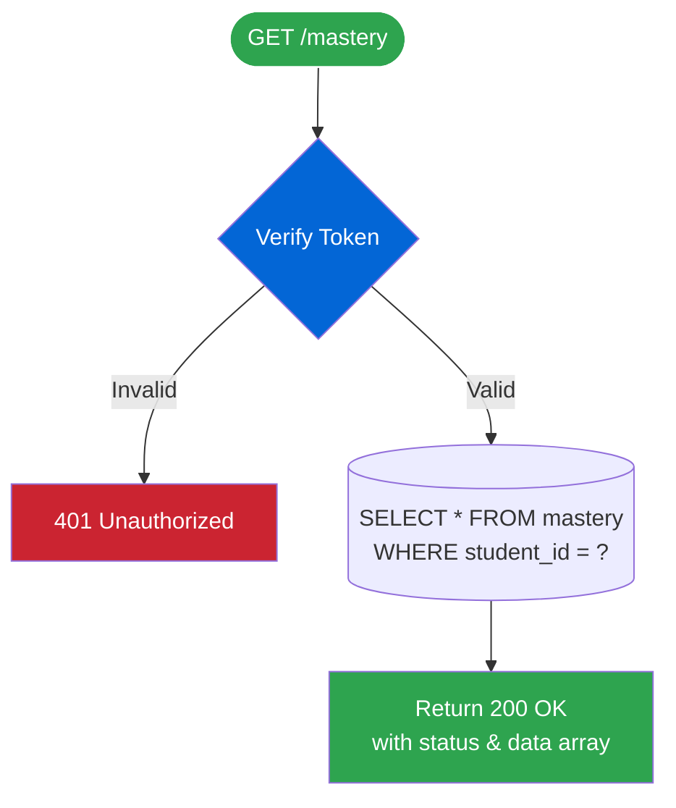
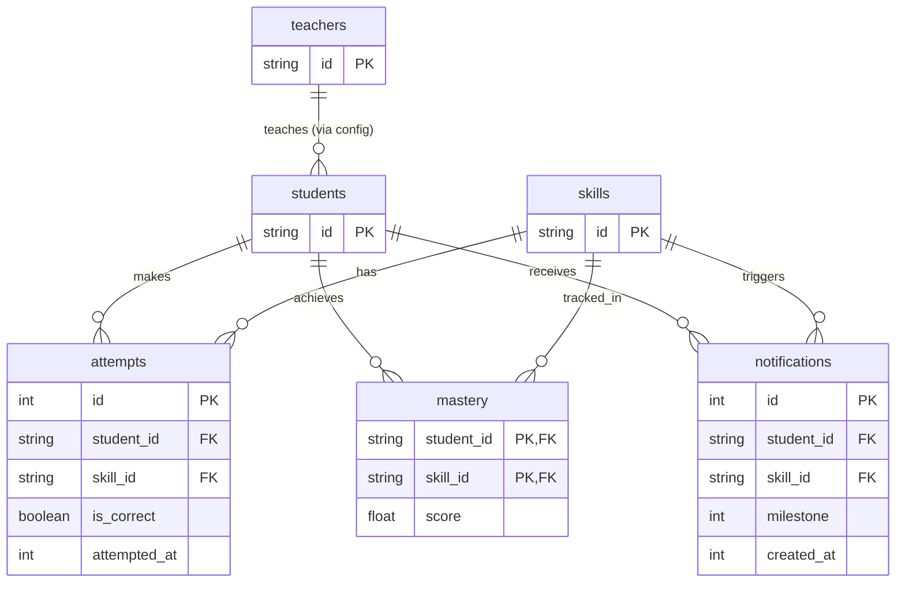

# GenEd Mastery Service — Design Specification

This document provides a comprehensive overview of the system architecture, abstractions, database schema, and endpoint workflows.

## 1. How the Code is Organized

The project is split into separate files so it's easy to read and maintain. 

### What each file does:
- **`main.py`**: The entry point. It sets up the web server, handles the incoming URLs, and checks that users have a valid token before letting them in.
- **`config.py`**: Stores all our settings in one place (like the 30-attempt rate limit and the 80-point milestone threshold) so they are easy to change later.
- **`endpoints.py`**: The brain of the app. This is where the actual work happens: doing the math for mastery scores and saving things to the database.
- **`database.py`**: Handles talking to the SQLite database. It has a special `get_db()` function that ensures if a request crashes halfway through, any half-finished database saves are completely undone (rolled back).
- **`utils.py`**: Helper functions, like the math formula for calculating the mastery score and the rules for who is allowed to access what data.
- **`models.py`**: Defines the exact shape of the data we expect to receive and send out (like making sure an attempt has a `skill_id` and a boolean `is_correct`).
- **`seed_data.py`**: Our fake data for testing, containing the mock teacher tokens, student rosters, and valid skill lists.
- **`ai_feedback.py`**: A fake AI service that pretends to take a few seconds to write feedback for a student's attempt.

## 2. API Endpoints & Workflows

### `POST /students/{student_id}/attempts`
**Workflow Diagram**:

**Purpose**: Submits a new learning attempt for a student.
**Workflow (`process_attempt`)**:
1. **Auth Verification**: Uses `verify_student_only_access` to ensure the caller is a STUDENT and their ID matches the URL.
2. **Skill Validation**: Checks if the requested `skill_id` exists in `SKILL_IDS`. Returns 400 immediately if invalid.
3. **Rate Limiting**: Checks if the student has >= 30 attempts in the rolling 24 hours (queries attempts table) and returns 429 if so. Executed after skill validation so bad inputs don't count.
4. **Mastery Fetch**: Queries the `mastery` table to get the student's current score (defaults to 0.0).
5. **Mastery Calculation**: Computes the new score via `calculate_new_mastery`.
6. **Ledger Insert**: Saves the attempt into the `attempts` table.
7. **Mastery Upsert**: Uses `ON CONFLICT DO UPDATE` to save the new score into the `mastery` table.
8. **Milestones**: Checks if `new_score >= 80` and uses `INSERT OR IGNORE` to atomically save a notification without duplicating.
9. **Feedback**: Call `ai_feedback.py` in the background (gracefully falling back if it fails).

### `GET /students/{student_id}/mastery`
**Workflow Diagram**:

**Purpose**: Gets all the mastery scores for a specific student.
**How it works**: It checks that the user is allowed to view the data (either the student themselves, or their teacher). Then it fetches their scores from the `mastery` table. If the student hasn't done any work yet, it just returns an empty list instead of an error.

### `GET /notifications/{student_id}`
**Purpose**: Gets all the milestone notifications for a student.
**How it works**: Checks permissions, then grabs the student's alerts from the `notifications` table.

### Utility Endpoints
- `GET /health` & `GET /api_name`: Basic connectivity checks.
- `GET /identity`: Resolves the provided Bearer token into a `{role, user_id}` identity.
- `GET /has_access/{student_id}`: Test endpoint to explicitly verify role-based access control rules.

## 3. Database Safety Rules

- **Crash Protection (Rollbacks)**: We wrote the database connection in a way that groups all saves together. If the server crashes while saving an attempt, the database immediately undoes any partial saves. This means we never get stuck with corrupted or half-saved data.
- **Smart Updates (Upserts)**: When we save a new mastery score, we use a database trick to say "If this student already has a score for this skill, just overwrite it. If they don't, create it." This prevents duplicate scores from piling up.

## 4. Security Rules

- **Who can see what?**: Students are strictly locked to viewing their own data. Teachers can view data for any student assigned to their specific roster.
- **Who can submit work?**: Only students are allowed to submit attempts. Teachers can view scores, but they cannot take a test on behalf of a student.
- **Hiding valid IDs**: If someone tries to look up an invalid student ID, we return a generic "Forbidden" error rather than saying "Not Found". This stops hackers from guessing which student IDs are real.

## 5. Database Schema

The service uses SQLite for persistence. Dimension tables (`students` and `skills`) are pre-populated using the `seed_db()` script based on `seed_data.py`.

### Entity-Relationship Diagram (ERD)

### 1. `teachers`, `students`, `skills`
Simple dimension tables with an `id TEXT PRIMARY KEY`.

### 2. `mastery`
Stores the current mastery score.
| Column | Type | Constraints |
| :--- | :--- | :--- |
| `student_id` | `TEXT` | `PRIMARY KEY, NOT NULL` |
| `skill_id` | `TEXT` | `PRIMARY KEY, NOT NULL` |
| `score` | `REAL` | `NOT NULL, DEFAULT 0.0, CHECK(0-100)` |
*(Composite PK on `student_id` and `skill_id`)*

### 3. `attempts`
Ledger of every attempt. Used for historical tracking and rate-limiting.
| Column | Type | Constraints |
| :--- | :--- | :--- |
| `id` | `INTEGER` | `PRIMARY KEY AUTOINCREMENT`|
| `student_id` | `TEXT` | `NOT NULL` |
| `skill_id` | `TEXT` | `NOT NULL` |
| `is_correct` | `BOOLEAN` | `NOT NULL` |
| `attempted_at`| `INTEGER` | `DEFAULT (cast(strftime('%s','now') as int))` |
*(Includes index `idx_attempts_student_time` on `(student_id, attempted_at)` to optimize rate limits.)*

### 4. `notifications`
Durably records when a student crosses a mastery threshold.
| Column | Type | Constraints |
| :--- | :--- | :--- |
| `id` | `INTEGER` | `PRIMARY KEY AUTOINCREMENT`|
| `student_id` | `TEXT` | `NOT NULL` |
| `skill_id` | `TEXT` | `NOT NULL` |
| `milestone` | `INTEGER` | `NOT NULL` (e.g. 80) |
| `created_at` | `INTEGER` | `DEFAULT (cast(strftime('%s','now') as int))` |
*(Includes a `UNIQUE` constraint on `(student_id, skill_id, milestone)` to prevent duplicate milestone triggers.)*

## 6. API Data Shapes

We use strict templates (called Pydantic models) to make sure users always send us the right data:
- **`AttemptRequest`**: What the student sends us (the skill they practiced, and if they got it right).
- **`AttemptResponse`**: What we send back (their new score and the AI feedback).
- **`MasteryItem`**: A single score for a specific skill.
- **`MasteryResponse`**: A list of `MasteryItem` scores bundled together.
- **`NotificationItem`**: A single milestone alert (like hitting 80 points).
- **`NotificationResponse`**: A list of `NotificationItem` alerts bundled together.
